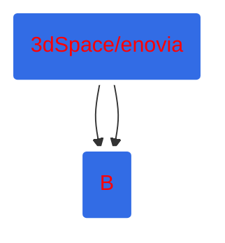

# 3DX Serving architecture

```mermaid 
graph 
   accTitle: My title here 
   accDescr: My description here 
   n1(3ddashboard)-->n3(B) 
   n1(3dSpace/enovia)-->n3(B) 
   classDef plain fill:#ddd,stroke:#fff,stroke-width:4px,color:#000; 
   classDef k8s fill:#326ce5,stroke:#fff,stroke-width:4px,color:#f00; 
   classDef cluster fill:#fff,stroke:#bbb,stroke-width:2px,color:#326ce5; 
   class n1,n2,n3,n4 k8s; 
   class zoneA,zoneB cluster; 
``` 

